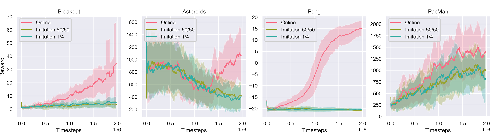
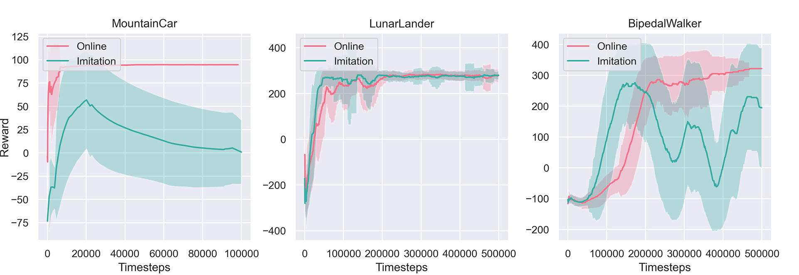

## Imitation Learning Project DDQN-SQIL + SAC-SQIL

Each notebook constitutes a self contained experiment, complete with training history, and is runnable in Colab as is. `train_checkpoints` contains final model weights for each trained agent.

I was unable to reproduce the authors results, and found online learning to be much more effective. Hopefully this negative result proves useful to someone.

